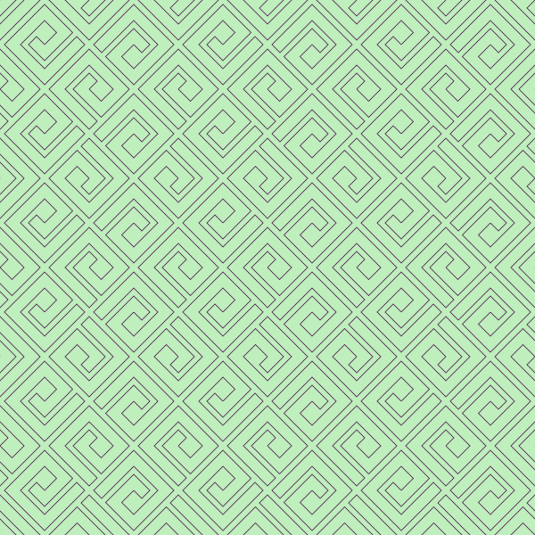
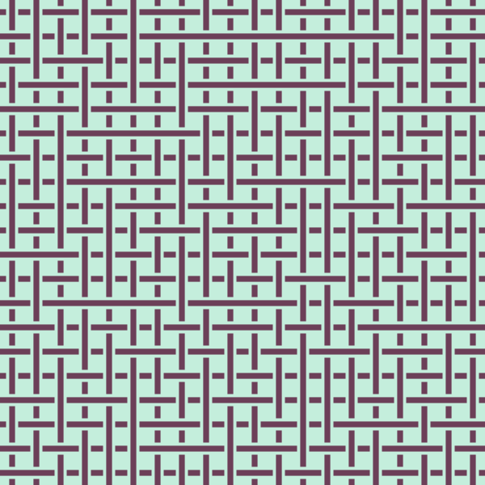
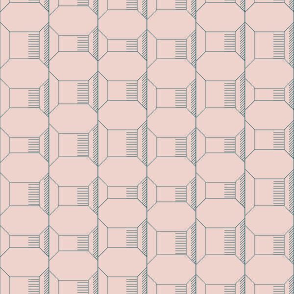

My repository of image-generator json files which I generate using
jsonnet.

## [tictoctoe.json](./tictoctoe.json)

## [astroids.json](./astroids.json)

## [e.json](./e.json)

## [honeycombs.json](./honeycombs.json)

## [masche.json](./masche.json)

## [pencils.json](./pencils.json)

